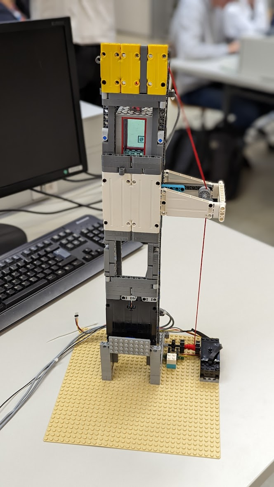
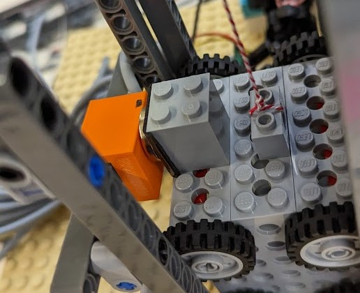

# Liftsteuerung

*** 

Projektmitglieder: 
* Sebastian Mayrhofer / *zuständig für Hardware und Dokumentation*
* Joel Rupp / *zuständig für Software*

 **HTL Rankweil**  4chel                                                                 Schuljahr 2022-23 

***

[TOC]

***

## Aufgabenstellung 

Im Projekt "Liftsteuerung" wird dass Konzept einer Liftsteuerung in Miniatur umgesetzt. Der Lift soll mit Hilfe von Lego Componenten und einer MegaCard gesteuert werden. Mit Hilfe einer Lichtschranke soll die Position der Kabine herausgefunden werden. Ebenfalls wird ein Hall Sensor als Endstop genutzt. 

## Umsetzung

Uns wurde ein sehr minimalistischer und filigraner Liftschacht ohne Technik oder der Gleichen zur verfügung gestellt, wir haben den Liftschacht verstärkt und der Kabine Rollen montiert, die die Fahrt stabilisieren sollen. 

### Benutztes Material

* Lego-Steine  (Lift Schacht und Kabine) 
* MEGACard  (Steuerung des Motors, auswertung der Sensoren)
* Hall Sensor (End-Stop)
* Lichtschranke (Stockwerkbestimmung)

### Stockwerk-bestimmung (Lichtschranke)

Um die Stockwerke genau zu bestimmen, benutzen wir, wie vorgegeben, eine Lichtschranke. Diese Lichtschranke wurde unterbrochen durch ein Lego Technik Teil das wir direkt auf Antriebsachse (Winden Achse) gesteckt haben.

*Lichtschranke Halterung mit Unterbrecher*

*realer Aufbau*

**Wie Messen wir mit Hilfe der Lichtschranke ?** 

Mit Hilfe eines Interrupts der auf fallende Flanke des Sensors (also das Unterbrechen der Lichtschranke) reagiert können wir die Stockwerke bestimmen.

### Endstops 

Mit Hilfe eines HallSensoren im untersten Stock wurde ein Endstop realisiert. Dieser wird Benutzt um die Position der Kabine, nach einem Reset bzw Neustart der MegaCard, zu bestimmen. 

Der uns zur Verfügung gestellte Hall Sensor: 

*in orange, der Hall Sensor*

Dieser wird ausgelöst durch einen Magnet der an der Kabine befestigt ist. Hierdurch können wir die Software kalibrieren und den Null Punkt festlegen. 

### Motor Ansteuerung 
Wir steuern den Aufzug Motor, ein Lego Eisenbahn Motor, mit Hilfe eines MotorTreibers an, dieser ist an PC6 und PC5 angeschlossen.

### Verkabelung 

