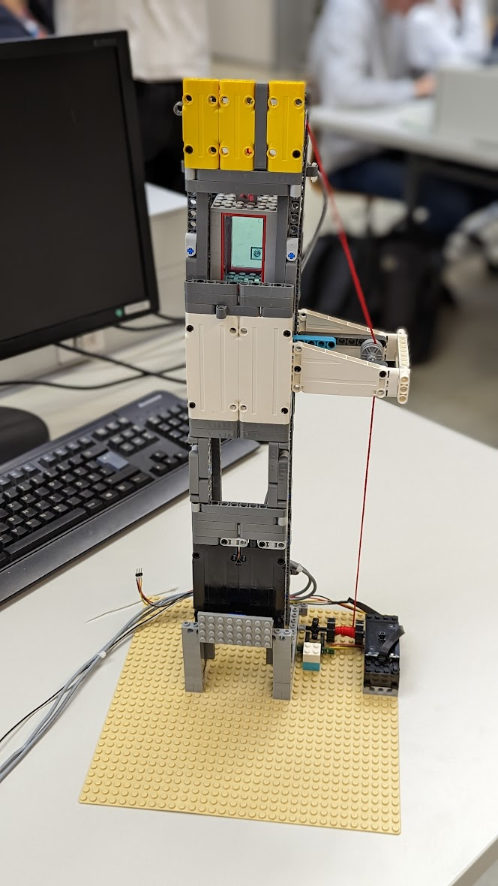
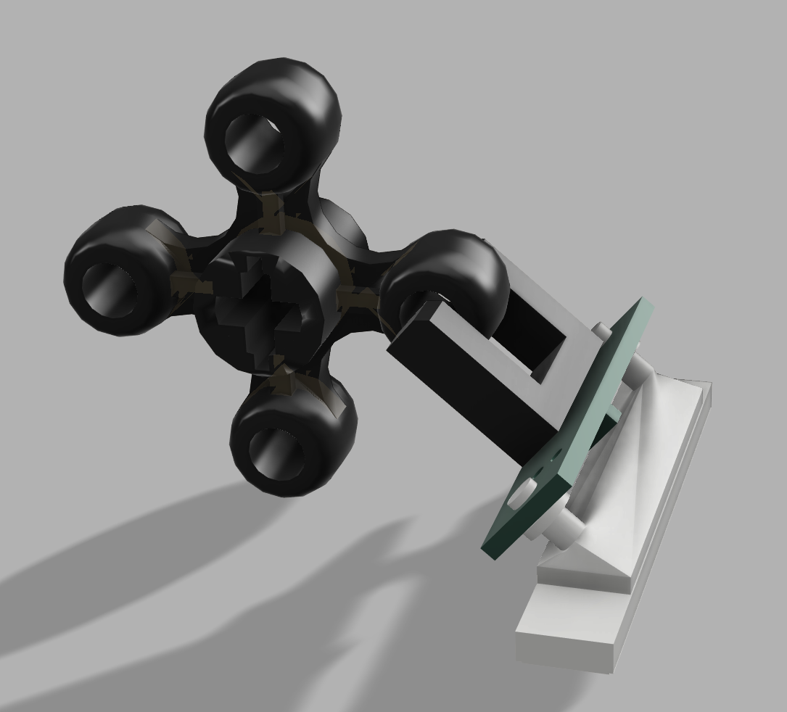
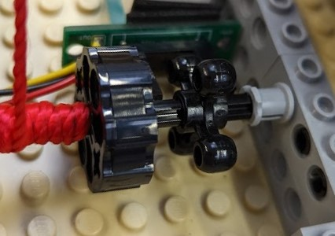
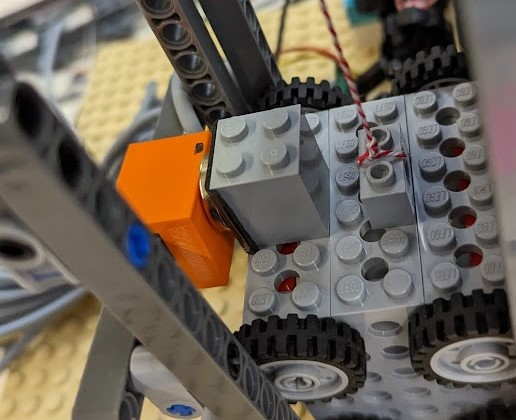
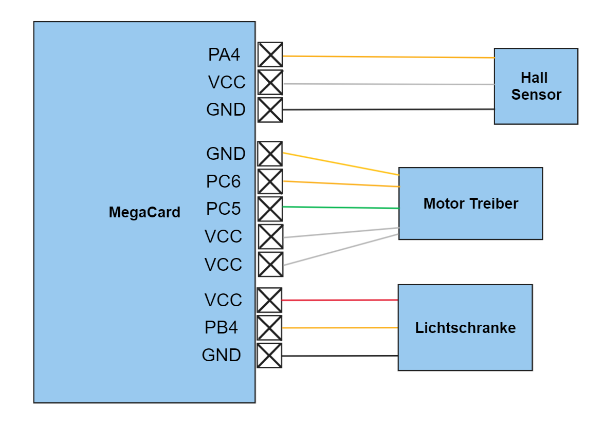
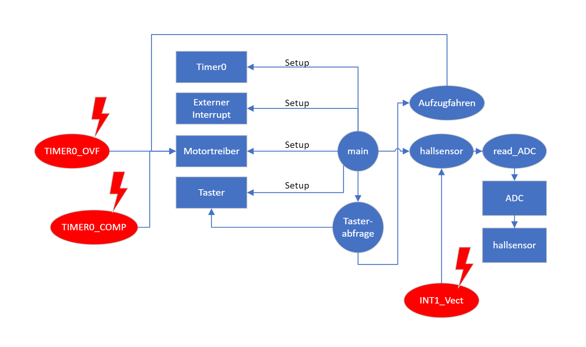

# Liftsteuerung

*** 

Projektmitglieder: 
* Sebastian Mayrhofer / *zuständig für Hardware und Dokumentation*
* Joel Rupp / *zuständig für Software*

 **HTL Rankweil**  4chel                                                                 Schuljahr 2022-23 

***

[TOC]

***

## Aufgabenstellung 
*verfasst von Sebastian Mayrhofer*

Im Projekt "Liftsteuerung" wird dass Konzept einer Liftsteuerung in Miniatur umgesetzt. Der Lift soll mit Hilfe von Lego Componenten und einer MegaCard gesteuert werden. Mit Hilfe einer Lichtschranke soll die Position der Kabine herausgefunden werden. Ebenfalls wird ein Hall Sensor als Endstop genutzt. 

## Umsetzung 
Uns wurde ein motorisierter Liftschacht aus Lego zur Verfügung gestellt. Wir haben den Liftschacht verstärkt und der Kabine Rollen montiert, die die Fahrt stabilisieren sollen. 

### Benutztes Material

* Lego-Steine  (Lift Schacht und Kabine) 
* MEGACard  (Steuerung des Motors, auswertung der Sensoren)
* Hall Sensor (End-Stop)
* Lichtschranke (Stockwerkbestimmung)

### Eindeutige Bestimmung des Anfangszustands -Joel

### Stockwerk-bestimmung (Lichtschranke)

Da nach einem Reset die Position des Liftes unbekannt ist, muss irgendwie ein bestimmer Zustand hergestellt werden. Dies ist bei uns so realisiert, indem der Aufzug nach unten fährt, bis der untere Endstop auslöst. Dann wir die Höhe genullt

Um die Stockwerke genau zu bestimmen, benutzen wir, wie vorgegeben, eine Lichtschranke. Diese Lichtschranke wurde unterbrochen durch ein Lego Technik Teil das wir direkt auf Antriebsachse (Winden Achse) gesteckt haben.

*Lichtschranke Halterung mit Unterbrecher*

*realer Aufbau*

**Wie Messen wir mit Hilfe der Lichtschranke ?** 

Mit Hilfe eines externen Interrupts der auf die fallende Flanke des Sensors (also das Unterbrechen der Lichtschranke) konfiguriert ist können wir die zurückgelegten Umdrehungen, und somit das aktuelle Stockwerk bestimmen.

### Endstops -Sebastian

Mit Hilfe eines HallSensoren im untersten Stock wurde ein Endstop realisiert. Dieser wird Benutzt um die Position der Kabine, nach einem Reset bzw Neustart der MegaCard, zu bestimmen. 

Der uns zur Verfügung gestellte Hall Sensor: 

*in orange, der Hall Sensor*

Dieser wird ausgelöst durch einen Magnet der an der Kabine befestigt ist. Hierdurch können wir die Software kalibrieren und den Null Punkt festlegen. 

### Motor Ansteuerung
*ab hier Joel Rupp verfasst*

Wir steuern den Aufzug Motor, einen Lego Eisenbahn Motor, mit Hilfe eines Motortreibers an, dieser ist an PC6 und PC5 zur Steuerung angeschlossen, als auch zweimal an VCC und einmal an GND

### Verkabelung 

### Probleme 

Wenn oft zwischen den Stockwerken 1 und 2 hin- und hergefahren wird, kann ein Fehler beobachtet werden, welcher immer großer wird. Wenn ins Erdgeschoss gefahren wird, wird dieser Fehler zurückgesetzt. Eine mögliche Erklärung dieses Fehlers folgt nun. 

~~~c
if (direction==2)	//Falls nach oben gefahren wird
	{
		heightticks++;	//Zählvariable erhöhen
	}
	if (direction==1)	//Falls nach unten gefahren wird
	{
		heightticks--;	//Zahlvariable verkleinern
	}
~~~
*Code in der ISR der Lichtschranke*

Da beim Auslesen der Lichtschranke keine Richtung bekannt ist, wird diese bei uns anhand der eingestellten Drehrichtung des Motors bestimmt. Wenn nun der Motor gestoppt wird, bleibt dieser aber nicht sofort stehen. Dadurch kann es passieren, dass der Geber in die nächste Stufe "rutscht", dies aber nicht erfasst wird. Wenn dies nur in eine Richtung passiert, addiert sich der Fehler

### System-Hierarchie 

*Die Interrupts sind Rot eingefärbt*

### Mögliche Verbesserungen 
* Es könnte noch ein Hallsensor als oberer Endstop verwendet werden, dies würde den Fehler beheben
* Um den Kabelsalat zu beseitigen könnte eine Adapterplatine designed werden, welche nur auf die MegaCard aufgesteckt werden müsste
* Mit der MegaCardV5 oder neuer könnte das Display benutzt werden, um Fahrtrichtung und Stockwerk anzuzeigen
* Ein Softwarereset könnte über einen Watchdogtimer realisiert werden, um im Fehlerfall automatisch zu resetten

## Mehr Informationen

* Repository: https://github.com/basti-debug/lift
* Anleitung: https://github.com/basti-debug/lift/blob/main/docu/Anleitung.md
