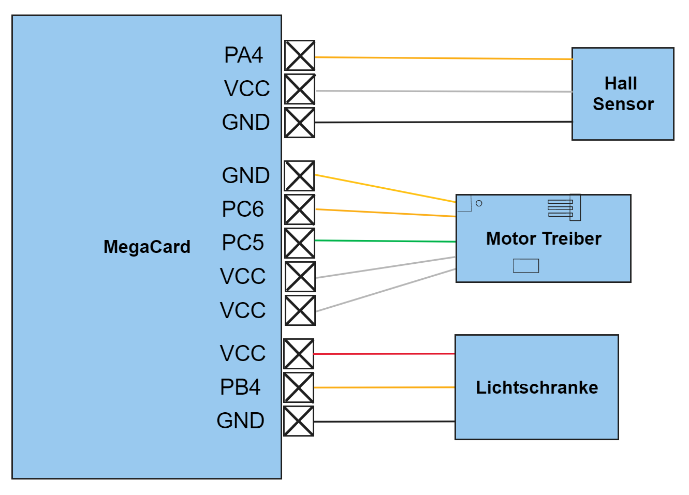

# Anleitung Liftschacht

## Anschlussdiagram:

## Funktionsbeschreibung
* Reset: Nach einem Reset fährt der Aufzug in das Erdgeschoss hinunter.
* Taster 0-2: Die Tasternummer gibt das Stockwerk an, in welches gefahren werden soll.
* LEDs: Anhand der LEDs kann die aktuelle Ansteuerung des Motors gesehen werden. Wenn beide leuchten wird gebremst, ansonsten wird gefahren. 
